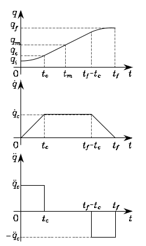

# Pianificazione/Interpolazione Traiettoria

Lo scopo della pianificazione di traiettoria è di generare input per il sistema di controllo del movimento, per fare eserguire al manipolatore traiettorie pianificate.
La pianificazione consiste nel generare un time sequence of the values attained interpolando una funzione (tipicamente polinomiale) della traiettoria desiderata.
Ci sono più tecniche: _point to point motion_ e _motion through space_. Considereremo prima il problema della pianificazione di traiettoria nel joint space e poi nell'operational space.

## Path e traiettoria

Il _path_ denota il luogo dei punti nel joint space, o nell'operational space, che il manipolatore deve seguire per eseguire il movimento assegnato; il path è solo una descrizione geometrica del moto. 
La _traiettoria_ invece è il path, con all'interno specificati i timing (in termini di velocità e/o accelerazioni) in ogni punto.
In linea di principio gli input del pianificatore di traiettoria sono la descrizione del path, i constraints del path, e i contraint imposti dalle dinamiche del maipolatore, mentre come output abbiamo le traiettorie dell'end-effector in termini di sequenza di valori di posizione velocità e accellerazione.

## Traiettorie nello spazio dei giunti

L'algoritmo di pianificazione genera una funzione $q(t)$ interpolando i vettori delle variabli dei giunti in ogni punto, rispettando i costraint dati.

Un algoritmo di pianificazione di traiettoria deve avere le seguenti features:

- Le traiettorie generate non devono essere computazionalmente pesanti

- Le posizioni e velocità dei giunti devono essere funzioni del tempo continue (si può imporre anche la continuità delle accelerazioni)

- Minimizzare effetti non desiderati come traiettorie non smooth.

Specifico tempo in modo che ogni giunto raggiunga la posizione finale nello stesso tempo.

### Movimento point to point

In questo tipo di movimenti il manipolatore si deve muovere da un punto iniziale ad un punto finale in un tempo $t_f$. 

Possiamo usare un metodo (così detto approccio parabolico) in cui il profilo di velocità ha un profilo parabolico, l'accelerazione un profilo lineare.
Un'alternativa ha questo approccio è il profilo con velocità trapezioidale, che impone un'accelerazione costante nella fase di inizio, una velocità di crociera e infine una decelerazione costante. 

Se non c'è un periodo con velocità di crociera si ottiene un profilo triangolare.

### Movimento tra sequenza di punti

Per applicazioni più complesse è utile assegnare una sequenza dipunti per monitorare meglio le traiettorie eseguite. Il problema è generare una traiettoria quando N punti sono specificati e devono essere raggiunti dal manipolatore in certi istanti di tempo. Per ogni joint variable ci sono N constraings, e quindi si potrebbe pensare di usare un polinomio di ordine N-1. Questa scelta ha svantaggi:

- Non è possibile assengare velocità iniziale e finale.

- L'accuratezza numerica per la computazione di coefficienti polinomiali decresce al crescere dell'ordine del polinomio.

- Il sistema risultante è difficile da risolver

- I coefficienti dipendono da ogni punto, quindi se si cambia un punto si devono ricalcolare tutti i coefficienti

## Traiettorie nello spazio operazionale (o cartesiano)

Quando si vuole che il movimento dell'end-effector segua un path nello spazio operazionale è necessario pianificare la traiettoria nello stesso spazio. Il planning pià essere fatto o interpolando una sequenza di punti del path o generando la primitiva analitica del movimento e la traiettoria relativa in modo puntuale.

#### note

Aspetto detto solo in modo implicito, se il programmatore non ha deciso anche il tempo entro cui completare il movimento, il primo passo è quello di identificare il giunto più lento, quello che pur raggiungendo la velocità massima, impiega più tempo a raggiungere il suo setpoint di posizione. Gli altri giunti, che potrebbero tutti essere più veloci ovvero raggiungere il loro setpoint in meno tmepo, verrano opportunamente rallentati, al limite (anche riducendo la accelerazione) non raggiungendo nemmeno la velocità di crociera ovvero seguendo un profilo di velocità che si riduce ad essere triangolare.
