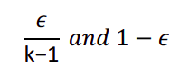

% Advanced Machine Learning, 2021/2022
% Federica Di Lauro
%

# Deep learning

Deep learning -> NN with several layers of nodes.

Deep learning is inspired by our brains.

## Feed Forward Neural Networks

Alghoritms for training multilayer networks are complex.

**Weight learning**: dumb.
If $f(x)$ is non-linear in theory we only need a single hidden layer.

Multi-layer networks recognize different "levels" of features depending on the layer "level".

A way to train multi-layer NNs is to train first the first layer, then the second, and so on..

Each layer (apart from the output layer) is trained to be an auto-encoder.

The auto-encoder wants to encode the stuff, ignoring the noise.

- Feed Forward NN: no loops, arrows go only in next layer. Usually they are fully connected, which makes them prone to overfitting

- Recurrent NN: loops on the nodes, the looping ensures that sequential information is captured in the input data.

- Convolutional NN: hierarcal pattern in data, assemble complex patterns using smaller and simpler patterns. Very effective in image recognition. Not all layers in the neurons are connected to next layer. We have 3 dimensions

**FFN**: DAG connecting various functions. The training data doesn't contain what the hidden layers should output.

When we have $x$ data and we eant to find $f(x)$ we can also try to map $x$ to a linear space with a $\phi$ function, as seen in SVM using kernels. 
There are 3 ways to obtain $\phi$:

- Use a predifined $\phi$
- Write it by hand
- Learn it! This is what deep learning does

$$
f(x,\theta,\omega) = \phi(x, \theta)^T \omega
$$

where $\theta$ are the parameters used to learn $\phi$ from a broad class of functions while parameters $\omega$ map from $\phi(x)$ to the desired output.

In deep learning $\phi$ defines a hidden layer.

#### Note about the Kernel Trick

Related to SVMs (but also to all the algorithms that use the vector product).
When using SVM we map our data in a higher dimensional space to separate the data in a better way and then calculate the distance.
The kernel trick allows us to directly calculate the distance in a higher dimension, without actually performing the mapping of the data in the higher dimensional space.

The decision function $f(x)$  of a kernel machine (any algorithm that uses kernels) is linear with the number of training examples.

Deep learning overcomes this limitation.

## Multi-layer Networks and Backpropagation

The backpropagation algorithm allows the information from the cost to flow backwards through the network in order to compute the gradient.

Each neuron is composed of 2 units:

- the first unit adds the product of the weights and the input signals (plus the bias)

- the second unit is a nonlinear function, called the activation function. It takes the number calculated by the first unit and the output of the nonlinear function is the output of the neuron.

So the data "enters" the NN, each neuron calculates its output and "transmit" it to the next layer and so on. After this we can find the output signal of our network and compare it to the desired output (the target). We then make adjustements based on the error.

We then do the actual backpropagation which allows us to calculate the **gradient** for each parameter by backpropagating the error and applying the chain rule.
We can think of the gradient as a vector which tells us how much each parameter influences the cost function. 
Each parameter gets updated based on the gradient by subtracting the gradient multiplied by the learning rate to the previous parameter.

## Gradient based learning

**Loss function** $L(\hat{y}, y)$ assigns a numerical score to a predicted output $\hat{y}$ given the true expected output $y$

The parameters $\theta$ of the learned function are then set to minimize the loss $L$ over the training samples.

So we have the loss $J(\theta)$:

{ width=50% }

We want to find the set of parameters $\theta$ such as the value of $J(\theta)$ is minimized:

{ width=75% }

This results in _overfitting_ because we are trying to minimize the loss over the training samples at all cost. To overcome this we can introduce a **regularization function**:

{ width=75% }

Where $R(\theta)$ correspond to a scalar that reflects the parameter "complexity" and $\lambda$ is an hyperparameter that controls the trade-off between bias and variance.

### Stochastic Gradient Descent (SGD)

We use **minibatch** of examples drawn from the training set to train our NN, of $m$ dimension.

So we calculate the gradient over each example in the minibatch and then we take the mean of this gradient.

- High values of $m$ provide better estimates of the training gradient

- Small values of $m$ allow more updates and faster convergence

- It provides efficient training: for small values of $m$ GPUs allow parallel implementation of the gradeient.

## Loss functions

The loss function is the function that computes the distance between the current output of the algorithm and the expected output.

For **Classification** problems we have:

- **Cross-entropy**: the goal is to measure the difference between two averages of the number of bits of distribution of information. The cross-entropy as the Log Loss function (not the same but they measure the same thing) computes the difference between two probability distribution functions.

Different types of cross-entropy:

- Binary cross-entropy: for binary classification problem
- Categorical cross-entropy: binary and multiclass problem, the label needs to be encoded as categorical, one-hot encoding representation (for 3 classes: [0, 1, 0], [1,0,0]…)

For **Regression** problems we have:

- **MSE**: mean square error
- **MAE**: mean absolute error

## Output units

- **Linear** for Gaussian distributions: 
- **Sigmoid** for Bernoulli output distributions: used for binary classification. It ensures a strong gradient if the prediction is wrong. It is used with cross-entropy cost function.
- **Softmax** for Multinoulli output distributions: used for classification of multiple classes (more than 2). Generalization of sigmoid. We use it both to normalize the value of the probability of a class to be within 0 and 1, but also to make the sum of all the classes' probabilities equal to 1.
It is used with log-likelihood cost function.
- **Gaussian Mixtures** for multimodal regression: we use this when the conditional distribution can have different peaks in the probability for the same value of the input. It is particularly effective for generative models of speech or movements of physical objects.

## Hidden units
An hidden unit is usually made of a linear part and a non-linear part, called the **activation function**. We can choose between different activation functions:

- **Sigmoid**: as we have already seen is a nice function, and it is always differentiable. It brings the problem of the *vanishing gradient*.
- **tanh**: kind of like the sigmoid, but the values range from -1 to 1. It is mainly used for binary classification problems. It brings the problem of the *vanishing gradient*.
- **Rectified linear (ReLu)**: from -inf to 0 equals 0, than is a linear function. It is not differentiable in 0 but we rarely reach an optimum point in deep learning so it's not a big problem. ReLu is computationally efficient. The main advantage is that it doesn't activate all neurons at once.
- **Absolute value rectification**: it gives the absolute value of the input. It is used in object recognition from images where it makes sense to seek features that are invariant with respect to polarity reversal of input illumination
- **Leaky ReLu**: like ReLu, but for negative values we have a line with a little slope (the slope is the parameter $\alpha$).
- **Parametric ReLu**: like Leaky ReLu but the $\alpha$ parameter is not fixed, it is learned by the network.
- **Maxout**: it can be seen as learning the activation function. It is made up by multiples lines and they can be used to approximate any convex function.

## Regularization

Regularization guides the learning process in such a way that the optimal solution reached correspond to a model that does not simply minimize the loss with respect to the training set but a model that is able to deal with variability of data

In the context of deep learning, most regularization strategies are based on regularizing estimators. Regularization of an estimator works by trading increased bias for reduced variance.

### Parameter Norm Penalities

We can introduce a norm penality to the loss function.

{ width=35% }

where $\alpha$ is the hyperparameter that weights the contribution of the penality term $\Omega$ to the loss function.

Usually the norm penality penalizes _only the weights_ and leaves the biases unregularized. The biases typically require less data to fit accurately and also regularizing the biases can introduce a significant amount of underfitting.

It can be shown that the effect of weight decay is to rescale the weights along the axes defined by the eigenvectors of the Hessian matrix of the loss function.

#### L2 regularization

It is also known as _weight decay_. It shrinks the weights by a costant factor on each step.

L2 causes the learning algorithm to perceive the input as having higher variance, which makes it shrink the weights on features whose covariance with the output is low compared to this added variance.

#### L1 regularization

The weights become sparse: some weights become very close to zero.

#### L1 vs L2

L1 pushes the weights to 0, penalizing small weights more, L2 will penalize big weights more.

#### Norm penalities as costrained optimization

If we want to contrain the norm penalty to be less than some constant $k$ we could construct a lagrangian function and try to minimaze the loss, with the constraint on the norm penalty.

In order to solve this problem, we can use techniques that minimize the loss function $J$ and then project the solution obtained in the feasible region $\Omega(\theta) - k$

### Data augmentation

The best way to get better generalization is to train on more data.
Dataset Augmentation provides a cheap and easy way to increase the
amount of your training data.

### Noise robustness

#### Injecting noise on input

The addition of noise with infinitesimal variance at the input of the model is equivalent to imposing a penalty on the norm of the weights

#### Injecting noise on weights

This form of regularization encourages the parameters to go to regions of parameter space where small perturbations of the weights have a relatively small influence on the output.

In other words, it pushes the model into regions where the model is relatively insensitive to small variations in the weights, finding points that are not merely minima, but minima surrounded by flat regions.

#### Injecting noise on output

Often we can find errors in the labels of our dataset. One way to remedy this is to explicitly model the noise on labels. This is done
through setting a probability $\epsilon$ for which we think the labels are correct.
This probability is easily incorporated into the cross entropy cost function analytically.
An example is **label smoothing**, where instead of having 0 and 1 as labels we replace them as:

{ width=35% }

Label smoothing also has the advantage of preventing the pursuit of hard probabilities without discouraging correct classification.

### Multitask learning

We can train multiple models which have different tasks (labels), and make this models share the first few layers, building 2 networks where the first part of each network is _general_ and the second part is _task specific_. 

Intuitively, the additional task imposes constraints on the
parameters in the shared layers, preventing overfitting.
Improvement in generalization only occurs when there is something
shared across the tasks at hand.

From the point of view of deep learning, the underlying prior belief is the following: among the factors that explain the variations observed in the data associated with the different tasks, some are shared across two or more tasks.

### Early stopping

When training large models with sufficient representational capacity to overfit the task, we often observe that training error decreases steadily over time, but validation set error begins to rise again.

We can obtain a model with better validation set error by returning to the parameter setting at the point in time with the lowest validation set error.

### Parameter tying and parameters sharing

Parameter Tying refers to explicitly forcing the parameters of two models to be close to each other, through the norm penalty:

{ width=35% }

Parameter Sharing imposes much stronger assumptions on parameters
through forcing the parameter sets to be equal.

### Bagging and ensable methods

Bagging (short for bootstrap aggregating) is a technique for reducing generalization error by combining several models.

Train k different models on k different subsets of training data, constructed to have the same number of examples as the original dataset through random sampling from that dataset with replacement.
Have all of the models vote on the output for test examples.
Techniques employing bagging are called ensemble models.

### Dropout

To train with dropout, we use a minibatch-based learning algorithm that
makes small steps, such as stochastic gradient descent.
Each time we load an example into a minibatch, we randomly sample a
different binary mask to apply to all of the input and hidden units in the network.
The mask for each unit is sampled independently from all of the others.
The probability of a unit appering in the mask is $p$
At test time we scale down the weights by a factor of $p$.

Dropout can intuitively be explained as forcing the model to learn with missing input and hidden units.

Dropout training has some drawbacks we need to be aware of.
At training time, we are required to divide the output of each unit by the probability of that unit’s dropout mask.
The goal is to make sure that the expected total input to a unit at test time is roughly the same as the expected total input to that unit at train time, even though half the units at train time are missing on average.

Applying Dropout indirectly requires us to design larger systems to preserve capacity. Larger systems usually are slower at inference time.

### Adversarial training

Even the most accurate NNs have a 100% error rate on examples that have been intentionally constructed to ”fool” the network.
In many cases, the modified example is so similar to the original one, human observers cannot tell the difference.
These examples are called adversarial examples.
A NN can be trained on the adversarial examples to improve the training.

## Optimization

There are several differences between machine learning and pure optimization:

- Machine learning acts indirectly, unlike optimization
- Usually we want to optimize a performance measure P based on the test set and the problem may also be intractable
- We optimize a different cost function (the loss) hoping that it optimizes P as well. Therefore we optimize P only indirectly
- In pure optimization the optimization of the cost function is the goal itself

Typically the loss function is a simple average over the training set:

{ width=100% }

We would prefer to mimimize the objective function with respect to the training set using:

{ width=50% }

We call **risk** the function:

{ width=50% }

If we knew P_DATA, risk minimization would be reduces to a standard optimization task.

Since we don't know it we minimize the **empirical risk**:

{ width=50% }

where $m$ is the number of training examples.
The whole process is known as **emprirical risk minimization**.

Problems with empirical risk minimization:

- It is prone to overfitting
- The most effective optimization algotithms rely on gradient decent, but many loss functions have no useful derivatives

We have to rely on a different approach: the quantity that we actually optimize is different from the quantity that we truly want to optimize

Instead of minimizing the emprical risk, we minimize the **surrogate loss function**

_A surrogate loss function acts as a proxy to empirical risk while being ”nice” enough to be optimized efficiently._

Example: the negative log-likelihood is a surrogate to the 0-1 loss for classification. 

In contrast to standard optimization we do not halt at local minima, but when the **early stopping halt criterion** is satisfied.

Typically, the early stopping criterion is based on an underlying loss function such as the 0-1 loss measured on the validation set, and is designed to halt the algorithm before overfitting occurs.

This can be roughly thought of as a way to reincorporate the true loss function in the learning process.

### Loss function

The loss function decomposes as a sum over the training examples

_The gradient in this case is also an expectation over the training data_

Computing this expectation exaclty is very expensive because it requires evaluating the model on every example in the entire dataset.

We compute this expectation by randomly sampling a small number of examples from the dataset at each iteration

The standard error of the mean estimated from m samples x is:

{ width=50% }

where $\sigma$ is the standard deviation of the value of the samples.

We can notice that there is less than linear return to using examples to extimate the gradient.

Optimization algorithms converge faster if they can rapidly compute approximate estimates of the gradient rather then slowly computing the exact gradient.

Furthermore there is redundancy in the training set, so computing the gradient on a small subsample of the training set makes sense since using all the samples wouldn't add much contribution.

### Batch, online and minibatch

Optimization algorithms that use all the training set to compute the gradient are called **batch** or **deterministic gradient methods**.

Optimization algorithms that use a a single training sample to compute the gradient are called  **stocastic gradient methods** (or online methods).

Optimization algorithms that use a small subsample of the training set are called **minibatch** or **minibatch stocastic methods**.

(notice that we will be calling the last ones stocastic methods)

#### Choosing the batch size

Large batches provide a more accurate gradient, but less than linear returns.

The batch size is usually a power of 2 to utilize GPU parallelization

Small batches can offer a regularizing effect, but may require small learning rates to keep stability.

Methods that only compute the update using the gradient can use small batch sizes (~100 samples), while methods that use second order derivatives require much larger batch sizes (~10000) expecially if H has a poor condition number.

#### Sampling mini-batches

The batches must be sampled at **random** because computing an unbiased estimate of the expected gradient require that the samples are indipendent.
Also 2 subsequent gradient estimates must be indipendent from each other.

We must **shuffle** the training set before selecting a minibatch. We usually shuffle the training set once and impose a fixed set of possible minibatches that training will use.

### Problems in optimization

#### Ill conditioning

Ill-conditioning of the Hessian matrix is a prominent problem in most numerical optimization problems, convex or otherwise.
Ill-conditioning is manifested in SGD by causing the algorithm to get stuck, in a sense that even very small steps increase the cost function.

Even if the algorithms doesn’t get stuck, learning will proceed very slowly when the Hessian matrix has a large condition number.

In multiple dimensions, there is a different second derivative for each direction at a single point.
The condition number of the Hessian at this point measures how much the second derivatives differ from each other.
When the Hessian has a large condition number, gradient descent performs poorly.
This is because in one direction, the derivative increases rapidly, while in another direction, it increases slowly.
Gradient descent is unaware of this change in the derivative so it does not know that it needs to explore preferentially in the direction where the derivative remains negative for longer.

#### Local minima

We will see that local minima are not necessarily a major problem (flat region is an acceptable solution).

Local minima are only truly problematic if they have a much higher cost than the global minimum.

#### Saddle points

For many high-dimensional non-convex functions, local minima and maxima are in fact rare compared to saddle points.

For first-order optimization algorithms that use only gradient information, the situation is unclear.
The gradient can often become very small near a saddle point.
On the other hand, gradient descent empirically seems to be able to escape saddle points in many cases.

For Newton’s Method, saddle points constitute a major problem.
This is because unlike gradient decent, which is designed to move downhill, Newton’s method actively seeks solutions at critical points where the
gradient is zero.
The proliferation of saddle points in high dimensional spaces explains why second order methods have failed to replace gradient decent for deep learning.

#### Flat regions

- They have zero gradient
- It takes a long time to traverse this regions
- Gradient wastes time circumnavigating tall mountains.

#### Cliffs and exploding gradient

Neural networks with many layers often have extremely steep regions resembling cliffs.

If we encounter a cliff then the update step can move parameters extremely far. Gradient does not specify the optimal step size, only the optimal direction within an infinitesimal region.
The traditional gradient descent propose to maje a very large step, but we can use the **clipping euristic** to reduce the step size to be small when we encounter a cliff.

#### Additional problems

- **Long term dependencies**: they arise when the computational graph is very deep and its result is vanishing and exploding gradient.
- **Inexact gradients**: we only have an estimate of the gradient and the Hessian. This is not a big issue in NN training since the surrogate loss function tends to perform well enough.
- **Poor correspondence between local and global structure**: if the direction that results in the most improvement locally does not point toward distant regions of much lower cost. Initialization is important for this reason.

### Basic optimization algorithms

#### Stochastic gradient descend

- Most used algorithm for deep learning

- Uses minibatches

It is common to deacay the learning rate linearly until a certain iteration.

#### Momentum

It accumulates the previous gradients. So if, for example, we are going down a slope the learning rate will increase

We can use SGD with momentum.

Some variants of the Momentum method exists, like Nsterov Momentum which adds a correction factor to the standard momentum.

#### Delta-bar-delta

If the partial derivative in respect to one parameter remains the same, increase the learning rate, otherwise, if that partial derivative change
sign, decrease.

#### AdaGrad

Scale the gardient according to historical norms.

- Learning rates of parameters with high partial derivatives decrease fast.

- Enforces progress in more gently sloped directions

- Nice properties for convex optimization but for deep learning it decreases the learning rate too much.

#### RMSProp (Root Mean Square Propagation)

Modification of AdaGrad to perform better in nonconvex problems.

AdaGrad accumulates scince the beginning, RMSProp uses an exponentially weighted moving average.

#### Adam (Adaptive Moments)

Variation of RMSProp + Momentum.

- Momentum is incorporated directly as an estimate of the first order moment

- In RMSProp momentum is included after rescaling the gradients

- Adam also add bias correction to the moments to account for their initialization at the origin

#### What algorithm to choose?

Most popular are: SGD, SGD with momentum, RMSProp, RMSProp with momentum, AdaDelta and Adam.

There is no clear choice.

### Parameters initialization

The initialization:

- can determine if the algorithm coverges at all
- modern techniques are simple and heuristic
- the only property known is the *need to break the symmetry*

Common initialization choices are **random** and **orthogonal matrices**, the first one is cheaper and performs well.

Biases are usually chosen heuristically.

**Gaussian initialization**:

- Choice of Gaussian or uniform distribution doesn't seem to affect much but the scale of the distribuition matters: _large weights break symmetry more but may explode_

- Weights should be large enough to propagate information efficiently and also small enough to make the model more robust for generalization.

Choosing the mean:

- The weights can be intrepreted as how much units interact with each other:
    - if the initial weight is high we put a prior on which units should interact
    - It is a good idea to initialize the weights around zero, without making them too small.

Some euristics is initialize the weights of a fully connected layer with m inputs and n outputs  by sampling the weights from:

{ width=50% }

**Sparse initializzation**:

- If we have a huge layer normalized initialization yields very low weights
- It has been proposed to have exactly k non-zero weights at each layer.
- This helps to keep higher values and increases diversity but it puts a strong prior on some connections and it may take a long time to fix wrong priors.

**Orthogonal matrices**:

I don't know, it exists, it apparently helps to avoid vanishing gradients.

#### Bias initialization

Easier than initializing weights:

- Common to initialize them as zero
- Sometimes other constants are used:
    - for output units it may be beneficial to initialize them according to the margianl statistics of the output
    - to avoid saturation use 0,1

