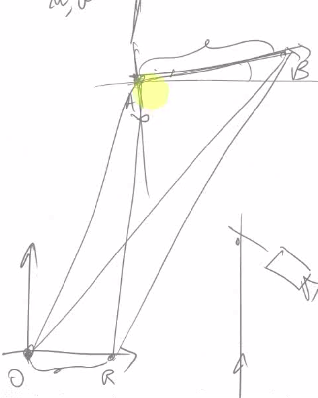

% Computer and Robot Vision, 2021/2022
% Federica Di Lauro
%

# Formazione dell'immagine

## Modelli geometrici

- prospettica
- ortografica
- scalata

**Modello pin-hole/proiezione prospettica**: immagine mondo reale - centro proiezione - immagine capovolta su piano immagine.

Sul piano immagine arrivano i raggi che passano dal foro.

**Proiezione ortografica**: punti non passano da un centro, quindi non sono ribaltati. Ad esempio posso usarla per camera nel cielo/spazio che guarda la Terra.

**Proiezione scalata**: proiezione intermedia tra prospettica e ortografica. Se guardo oggetti solo a una profondità le differenze prospettiche sono piccole, piccole differenze prospettiche.
Tipo nastro trasportatore con camera sopra.

### Modello pinhole

Retta che passa dal centro di proiezione $C$: retta di proiezione se la traccio da $P$ e $C$, retta di interpretazione se la traccio da $P'$ e $C$. 

Punto nel mondo $P(x,y,z)$, punto immagine $P(x', y', z')$.

Distanza piano immagine e centro proiezione è la distanza focale $f$, l' asse che passa su $f$ si chiama _asse ottico_.

Sapendo che $P'$ giace sul piano immagine possiamo dire che $z' = f$.
Sapendo anche che P e P' giacciono sulla stessa retta abbiamo che:

{ width=50% }
{ width=20% }

Se parto da immagine e trovo retta di interpretazione ho perdita di informazione, in quanto so trovare la retta ma non so trovare qual è il punto nel mondo, in quanto potrebbe trovarsi ovunque sulla retta trovata. Possibile soluzione è la stereoscopia.

Altra osservazione: stiamo dando per scontato di conoscere $f$.

Casi d'uso a seconda di variabili note e incognite:

|                 | Note          | Incognite |
|-----------------|---------------|-----------|
| Proiezione      | X, Y, Z, f    | u, v      |
| Interpretazione | u, v, f       | X, Y, Z   |
| Calibrazione    | X, Y, Z, u, v | f         |

Possiamo ribaltare il piano immagine e portarlo davanti al centro di proiezione, per non avere le coordinate "ribaltate". Chiamiamo questo piano _piano immagine virtuale_.

**Model based vision**: una piccola nota.
Quanto detto precedentemente (non poter sapere dov'è il punto nel mondo a partire dal punto immagine) è valido per un singolo punto.
Se nell'immagine ho un oggetto e conosco le caratteristiche dell'oggetto sono in grado di ricavare la posizione dell'oggetto e di quello che ha intorno.
Questa branca della computer vision non è parte del corso, non abbiamo abbastanza CFU per farlo.

## Dettagli tecnici sulle camere

### Necessità di lenti, lenti sottili

Dal punto di vista fisico il modello pinhole è irrealizzabile, in quanto il foro (centro di proiezione) non può essere infinitesimo nella realtà.

Il foro è di una dimensione finita, da cui passaranno più raggi paralleli, passiamo dall'avere un punto immagine ad avere un "cerchio immagine". I cerchi si vanno a sovrapporre e questo è un problema. Se restringo troppo il cerchio (cerchio infinitesimo) entra troppa poca energia (energia infinitesima). 

Si introduce quindi l'uso di lenti. Di solito si hanno più lenti insieme, noi ci soffermiamo su modello con singola **lente sottile**.
I raggi arrivano alla lente e convergono in un punto. Questo punto è chiamato **fuoco** della lente (questo se tutti i raggi arrivano paralleli tra loro). La lente è composta da due calotte sferiche, al centro troviamo un piano. Il centro di questo. La distanza tra il centro di questo piano e il fuoco è chiamata **focale della lente**.
Se da un punto $P$ arrivano raggi non paralleli tra loro troveremo un punto $P'$ diverso dal fuoco, in cui il punto immagine è a fuoco.
**Legge di Snell** (con $Z$ distanza centro lente - punto nel mondo e $Z'$ distanza centro lente - punto immagine): 
$$
1/Z + 1/Z' = 1/f
$$

I vari punti del mondo vanno quindi a fuoco ad una distanza diversa.

### Cerchi di sfocamento e profondità di campo

Il fatto che i vari punti vadano a fuoco a distanze diverse e che il piano immagine sia ad una distanza fissa porta ad avere dei "cerchi" sul piano immagine, i così detti **cerchi di sfocamento**.
Dipendono sia dalla posizione a cui vanno a fuoco i punti e dalla posizione del piano immagine.

### Spettro del campo elettromagnetico

Legato alle lenti è l'indice di rifrazione, che varia a seconda della lunghezza d'onda dello spettro.
(TODO trovare un senso a questa lezione).

### Frequenza di campionamento

I dispositivi digitali abbiamo una serie di elementi sensibili (sensori) disposti ad una certa distanza. La distanza tra essi fa si che il dispositivo abbia una specifica frequenza di campionamento legata anche alla lunghezza d'onda. 
Per catturare lunghezze d'onda di $n$ micrometri dobbiamo avere sensori disposti ad almeno $n/2$ micrometri tra loro.

Il diametro dei cerchi di sfocamento deve essere inferiore alla spaziatura dei sensori. Inizio a percepire la presenza dei cerchi di sfocamento esce dai confini del singolo sensore e viene percepito in più sensori.

Diametro cerchi di sfocamento:
$$
D/Z' * (Z'_{segnato} - Z')
$$

$Z'$ è il punto dove va a fuoco il punto.
$Z'_{segnato}$ è la distanza del piano immagine.
$D$ è il diaframma della camera, che limita i raggi entranti che si proiettano sul piano immagine.

Agendo sul diaframma riesco a modificare la **profondità di campo**.

## Difetti e problemi

### Aberrazioni cromatiche

Indice di rifrazione è dipendente dalla lunghezza d'onda. 

Allontanandosi dal centro immagine ci allontaniamo dal modello ideale pinhole.

Messa a fuoco dipende anche dalle lunghezza d'onda, aberrazione cromatica.

### FOV, Field of View, distorsioni radiale e tangenziale

**FOV**: più è lungo l'obiettivo più è "stretta" l'immagine.

Esempio lente fisheye: focale corta, grande FOV ma tante aberrazioni che ci fanno discostare da modello pinhole.

**Distorsione radiale**: distorsioni più intense delle tangenziali.
A loro volta si suddividono in:
- **a cuscinotto**: distanze centro immagine crescono.
- **a barilotto**: distanze centro immagine descrescono.

{ width=60% }

In funzione della distanza dal centro immagine la proiezione nominale cresce lungo il raggio oppure decresce lungo il raggio. 
Quindi spostamento punto immagine lungo la retta, in avanti o indietro ma resta sempre sulla retta.

**Distorsione tangenziale**: Il punto proiettato si sposta dalla retta di proiezione in modo ortogonale al raggio.

<u>**Le distorsioni non sono riconducibili ad un modello lineare di proiezione**</u>

Posso applicare un algoritmo per rimuovere distorsioni prima e successivamente applicare il modello lineare di proiezione.

### Vignetting

Cresce con lunghezza focale e cresce con distanza da centro immagine.
Il passaggio tra i vari "pezzi" dell'obiettivo fa perdere i raggi sui bordi interni dell'ottica. 
L'intensità luminosa media decresce al crescere della distanza dal centro immagine.
Questo problema aumenta all'aumentare della lunghezza dell'ottica.

## Calibrazione della proiezione

10 parametri? non ho capito

Rappresentazione in forma matriciale della proiezione con uso di coordinate omogenee.

Tornando alla proiezione del modello pin hole avevamo che:

$$
\begin{cases}
u = f*(X/Z) \\
v = f*(Y/Z)
\end{cases}
$$

Se abbiamo punto immagine $P^C$ ovvero il punto immagine in coordinate omogenee $|w_1, w_2, w_3, w_4|^T$ rispetto alla camera, possiamo trovare una matrice di dimensioni (3,4) tale che $M*P^C = |w_1, w_2, w_3|^T$, e possiamo dire che: 

$$
\begin{cases}
u = w_1/w_3 \\
v = w_2/w_3
\end{cases}
$$

Sappiamo anche che:

$$
\begin{cases}
w_1 = fx \\
w_2 = fy \\
w_3 = z
\end{cases}
$$

La matrice vista sopra è quindi:

$$
M = 
\begin{bmatrix}
f & 0 & 0 & 0 \\
0 & f & 0 & 0 \\
0 & 0 & 1 & 0 \\
\end{bmatrix}
$$

Se abbiamo anche la matrice $T^C_W$ che rappresenta la rototraslazione della camera rispetto al mondo possiamo trovare la proiezione rispetto al mondo:

$$
M \cdot T^C_W
$$

Problemi ancora aperti:
- centro immagine spostato
- aspect ratio non unitario: dobbiamo posizionare correttamente il valore di posizione in memoria nel piano immagine continuo. Dovuto alla disposizione degli elementi sensoriali e la loro spaziatura su asse x e y.

Per il primo punto abbiamo una pura tralsazione, per il secondo troviamo il rapporto tra la spaziatura sulle x e la spaziatura sulle y.

$$
\begin{bmatrix}
1 & 0 & u_0 \\
0 & 1 & v_0 \\
0 & 0 & 1 \\
\end{bmatrix}
$$
Per il secondo abbiamo una matrice per scaling
$$
\begin{bmatrix}
ar & 0 & 0 \\
0 & 1 & 0 \\
0 & 0 & 1  \\
\end{bmatrix}
$$

Moltiplicando tutte le matrici viste troviamo la matrice di proiezione totale.
Per scrivere la matrice totale abbiamo bisogno di 10 parametri:
- 3 di rotazione e 3 di traslazione per la matrice che rappresenta la rototraslazione tra camera e mondo
- 1 (ovvero $f$) per la matrice che proietta il punto
- 2 per la traslazione del centro immagine
- 1 per l'aspect ratio 

La matrice totale è una (3,4), ovvero ha 12 elementi, di cui 11 indipendenti in quanto stiamo usando matrici per trasformazioni omogenee.
Noi abbiamo trovato solo 10 parametri, l'11-esimo sarebbe lo "skew" ovvero l'angolo tra righe e colonne dell'immagine, ma questo (grazie a dio) è sempre 90° (zero skew).

### Calibrazione DLT (Direct Linear Transform)

Troviamo direttamente i valori numerici dei componenti della matrice totale di calibrazione.

In fase calibrazione abbiamo immagine e informazione tridimensionale del punto scena.
Effettuiamo quindi delle misure che ci danno delle relazione sugli 11 valori incogniti della matrice di calibrazione.
Ogni misura che prendiamo ha 5 elementi:

$$
\begin{bmatrix} x & y & z & u & v \end{bmatrix}^T
$$

Per ogni misura posso impostare un sistema.

$$
\begin{cases}
w_1 = m_{1,1} * x + m_{1,2} * y + m_{1,3}*z + m_{1,4} \\
w_2 = m_{2,1} * x + m_{2,2} * y + m_{2,3}*z + m_{2,4} \\
w_3 = m_{3,1} * x + m_{3,2} * y + m_{3,3}*z + m_{3,4}
\end{cases}
$$

Sapendo che $u = w_1/w_3$ e $v = w_2/w_3$ troviamo un sistema con due equazioni (per semplicità di scrittura non scrivo per esteso $w_1, w_2, w_3$ trovati sopra):

$$
\begin{cases}
u*w3 - w1 = 0 \\
v*w3 - w2 = 0
\end{cases}
$$

Quindi _teoricamente_ per trovare gli 11 parametri mi servono almeno 6 misure, però non ha senso in quanto ci saranno sicuramente errori nelle misure. Si usano centinaia di punti.

Andiamo a fare una regressione andando a minimizzare il quadrato degli errori.

Da una parte ho lo spazio tridimensionale dei punti (x,y,z) e lo spazio bidimensionale dello spazio 2d piano immagine con i punti (u, v).
Devo coprire tutto lo spazio.

Con DLT i vari componenti della matrice $M$ non hanno una struttura precisa, troviamo solo dei valori numerici, non riflettono la struttura "vera" della matrice con proiezioni, aspect ratio etc.

Aspetto pratico: immagine con un pattern (scacchiera o pallini), nel mondo reale metto pattern planare, così devo solo trovare la posizione del pattern planare e trovo successivamente la posizione dei pallini/quadrati conoscendo la posizione del pattern.
Metto sistema di riferimento mondo in un posto comodo, poi faccio triangolazione tra sistema e pattern planare.

{ width=60% }

Questa triangolazione è soggetta ovviamente a incertezze nelle misure.
Questa incertezza è non-costante, la distribuzione degli errori cambia al variare della distanza del punto dall'osservatore.

La precisione con il quale trovo AB dipende molto dalla distanza OR.

Dobbiamo rappresentare anche l'incertezza delle misure. Come? Lo scopriremo nel futuro.

Esistono configurazioni degeneri nello spazio 3D che non mi permettono di calcolare la matrice $M$. I punti che vado a prendere devono giacere su piani diversi.

### Calibrazione con metodo Zhang

NB sezione fatta mooolto poco, il prof voleva quasi tagliarla, basta sapere che esiste in pratica.

- Homography: si stanzia in un'omografia tra piani. Omografia -> punti di un piano finiscono in corrispondenza coi punti di un altro piano. Rappresentabile come trasformazione in coordinate omogenee.

- Parametri intrinseci/estrinseci.

Immagini utilizzate: target planare, solitamente scacchiera. 
Vengono determinati i punti di intersezione tra quadrati neri e quadrati bianchi.
Non fornisco l'informazione rispetto ad un unico sistema di riferimento.
Ciascun insieme di punti è noto nel suo sistema di riferimento (ovvero la scacchiera).

La tecnica Zhang lavora in 2 fasi. Inizialmente determina i parametri intrinseci, utilizzando le diverse immagini raccolte.
Dopo di che posso trovare gli estrinseci.

Questo approccio permette anche di calibrare i parametri di distorsione.

**Caratterizzazione di matrici proiezione prospettica**

Caratteristiche della matrice M di proiezione:

$$
M = 
\begin{bmatrix}
a_{1,1} & a_{1,1} & a_{1,1} & b_1 \\
a_{1,1} & a_{1,1} & a_{1,1} & b_2 \\
a_{1,1} & a_{1,1} & a_{1,1} & b_3 \\
\end{bmatrix}
$$

Se chiamiamo $A$ la matrice composta dagli $a_{i,j}$ si ha sempre che:

$$
det(A) \neq 0
$$

Se abbiamo una matrice con _zero skew_ possiamo dire che:

$$
(a_1 * a_3) \cdot (a_2 * a_3) = 0
$$

Se abbiamo una matrice con _aspect ratio unitario_ abbiamo:

$$
(a_1 * a_3) \cdot (a_1 * a_3) = (a_2 * a_3) \cdot (a_2 * a_3)
$$

