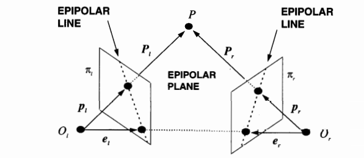

# Stereoscopia

Ricostruiamo il mondo avendo due camere e le immagini da esse scattate nello stesso momento.

Intersezione dell'asse ottico delle due camere: **punto di fissazione**. 

Linea che congiunge i due centri della camera: **baseline**. Più le camere sono distanti più ho precisione. *Vedi parte sulla triangolazione nel capitolo formazione immagine*

**Epipoli**: intersezione tra baseline e piani immagine. Se camere sono parallele sono all'infinito.
Tutto il piano identificato da puntomondo - centro camera 1 - centro camera 2 si chiama **piano epipolare**.

Problemi da affrontare per ricostruzione con stereoscopia:

- Abbiamo misure su piano immagine, informazioni sulle camere, dobbiamo intersecare P'C1 e P''C2. Problema triangolazione.
- Ricerca delle corrispondenze dei punti mondo nei due piani immagine.

Per la ricerca delle corrispondenze posso identificare un piano immagine come primario e uno secondario. Dò un identificativo ai punti sul primario, e cerco le corrispondenze nel secondario.
Poi faccio viceversa e confronto le corrispondenze.
Ricerca molto complessa.

Per la ricostruzione abbiamo che possiamo ricavarla dalla disparity, ovvero una volta trovate le corrispondenze troviamo la differenza $d = x_l - x_r$ e troviamo quindi la profondità $Z = f*\frac{T}{d}$, dove $T$ è la baseline.

**Ipotesi fondamentale stereoscopia**: Gli intorni di uno stesso punto nelle due immagini saranno circa simili. Vado a cercare un intorno di P' circa uguale a un intorno di P'' per la ricerca delle corrispondenze.

Tanto più è ampia la baseline più è a rischio questa ipotesi: più è ampia più cambio punto di vista e rischio di non trovare agevolmente le corrispondenze.

## Approcci alla stereoscopia

- Feature based: cerco delle corrispondenze a livello di "cose" nell'immagine

- Pixel level/gray level: trovo corrispondenze a livello di pixel sfruttando i vincoli della geometria

### Vincolo epipolare

Per trovare corrispondenze sfrutto il fatto che dal punto immagine P' il punto nel mondo è sicuramente un punto sulla line C1-P, quindi il punto corrispondente nel piano immagine 2 si troverà su questa retta proiettata, non devo ceracare in tutto il piano immagine 2.
Possiamo dire che il possibile punto corrispondente P'' si trova nell'intersezione tra il piano epipolare che si forma con C1-P-C2 e il piano immagine 2. La retta che viene a formarsi in questo modo è la **linea epipolare**.
Tutte queste linee passano per l'epipolo.

Più formamlemente diciamo che:
$$
\forall P'_{\pi_{1}} \text{ prendo sul piano immagine } \pi_{2} \text{ i punti appartententi alla } \textbf{linea epipolare } l \in \pi_{2}
$$
In questo modo riduciamo lo spazio di ricerca da $R^2$ a $R^1$.

### Algoritmi pixel-based

#### Correlazione

Ricerca di pattern tra le due immagini (segnali).

**Rettifica** delle immagini per fare stereoscopia, ovvero modifica delle immagini per avere le camere parallele. 
Viene più facile ricercare le corrispondenze.

Cerco scostamento del punto della primaria se lo immergo nella secondaria per trovare il suo corrispondente. Questo scostamento è chiamato **disparità**. Disparità ha dominio in 2 variabili e codominio in 2.

Con camere rettificate la disparità ha dominio in 2 e codominio in 1. <- Più facile

Diparità sparsa vs densa (pixel vs feature).

C'è anche il problema **foreshortening**, lo stesso pezzo di mondo può apparire di dimensioni diverse a seconda della prospettiva, quindi non posso basarmi solo su disparita x,y,z ma andrebbe presa in considerazione anche il cambio di dimensioni.

Regione $R(P_l)$ nel piano $r$ in cui vado a cercare il punto $P_l$ del piano $l$.
Questa regione si trova sulla linee epipolare.

Se da $P_l$ vado alle stesse coordinate nell'immagine $I_r$ e sommo la disparità $P_l$.
$\forall d(P_l) \in R(P_l)$ calcolo quanto vale la funzione che dice quanto sono simili i pixel, funzione $\psi(u,v)$ (u e v sono pixel).
Esistono diverse funzioni come crosscorrelazione, somma valori assoluti, somma quadrati...

In generale viene calcolata cifra di merito 
$$
c(d) = \sum^W_{k=-W} \sum^W_{l=-W} \psi(I_l(i+k, j+l),I_r(i+k - d_1, j+l -d_2))
$$

con $W$ dimensione finestra della regione di interesse.

La funzione $\psi$ può essere:

- crosscorrelazione $(u \cdot v)$
- SSD, sum of squared differencies: $-(u-v)^2$
- SAD, sum of absolute differencies (più veloce da calcolare)

Quanto deve essere grande la finestra? Abbastanza da trovare qualcosa di riconoscibile nel segnale. 
Fino a ora consideravamo W uguale per altezza e larghezza, ma è una semplificazione, possiamo avere dimensioni diverse.

#### Analisi multirisoluzione

Presa un'immagine posso applicarci un filtro passabasso e ottengo un'immagine derivata. 
Ottengo un'immagine con meno "dettagli" (vengono tagliate le alte frequenze). 
Posso applicare su questa nuova immagine un altro filtro passabasso e così via.

L'insieme di queste immagini è chiamato lo *scale space*.

Posso partire da un'immagine con molte frequenze tagliate, in quanto c'è meno segnale e quindi ho meno "cose" che posso associare.
Prendo i risultati che ottengo ad una scala alta come base per vincolare la ricerca ad una scala più bassa.

**Discontinuity preserving**: i filtri passabassi gaussiani non garantiscono che la posizione dei "bordi" rimanga la stessa nelle varie immagini.
Esistono alcuni algoritmi che sono in grado di farlo: anisotropic diffusion, steerable filters.

#### Metodi a minimizzazione di energia

Cerco una funzione di discontinuità.
Cerco funzione per minimizzare il gradiente della funzione sui punti.
TODO non ho capito nada.

### Algoritmi feature-based

Passo da un'immagine a una lista che descrive gli elementi delle immagini (sarebbero due liste, una lista per ogni immagine).

Algoritmi per ricerca di feature, come SIFT.

Criterio per valutare i match: similitudine del descrittore. Come similitudine prendiamo la vicinanza dei punti nello spazio delle coordinate che descrivono la feature.
Faccio media pesata differenze tra gli elementi.

Per ogni feature nella primaria trovo corrispondenze sulla linea epipolare. Trovo quindi i potenziali match, calcolo la similitudine e prendo la corrispondenza con similitudine maggiore.

Operare prendendo indipendentemente le feature non è ottimale.

#### Approcci multirisoluzione

Anche per gli algoritmi feature based abbiamo approcci multirisoluzione.

Se ho troppe feature il problema di ricerca di corrispondenze esplode.
Per questo vado a cercare feature in immagini con meno frequenze etc etc come già visto.

### Rettificazione
Come già detto si possono rettificare le immagini per portarmi ad una situazione in cui le due camere sono allineate. Elimino effetti di non allineamenti degli assi ottici.

### Vincoli usati in stereoscopia

1. Unicità: ad un punto nella primaria associo UN punto nella secondaria. Le corrisponenze sono biunivoche. TODO non univocità dei match?? Come è possibile?

2. Continuità: ipotizzo che il mondo che osservo sia fatto da superfici smooth/regolari. Non riusciamo bene a gestire il mondo discontinuo?

3. Ordinamento: i punti nella secondaria appaiono nello stesso ordine (specchiato) della secondaria rispetto agli epipoli.

4. Disparity gradient: se il valore di disparità che trovo nella soluzione è consistente posso avere dei delta di profondità maggiori. TODO?

Vincoli più "geometrici":

- cose piane TODO

- Aumentare il numero di camere per avere vincolo epipolare plurioculare. Ad esempio con 3 camere.
Dall'intersezione in $\pi3$ della linea epipolare coniugata che viene da $l1$ e $l2$ trovo un punto (o meglio, un'area intorno a quel punto) in $\pi3$ dove dovrebbe esserci il match. Approccio poco utilizzato attualmente.

## Geometria epipolare

Piccola nota introduttiva: faremo tutto il casino che segue in questa sezione per avere un modo facile di trovare la linea epipolare, che ci semplifica il lavoro di ricerca delle corrispondenze.

{ width=100% }

- $P_l$ e $P_r$ sono vettori $[X, Y, Z]$ che si riferiscono allo stesso punto 3D, con $P$ pensato come il vettore rispettivamente nel frame left e right,
- $T$ è la baseline 
- $R$ è la rotazione tra il sistema intrinseco right e il sistema intrinseco left.

Dato un punto $P$ nello spazio abbiamo:

$$
P_r = R(P_l - T)
$$

La relazione tra il punto mondo e il punto immagine è: 

$$
p_x = \frac{f_x}{z_x} P_x
$$

con $p_x$ punto immagine, $x = l,r$.

### Piano epipolare

Il piano epipolare è caratterizzato dal fatto che i vettori $P_l, T, (P_l - T) = P_r$ giacciono sullo stesso piano:

$$
(P_l - T)^T \cdot T \times P_l = 0
$$

che possiamo scrivere anche (vista la relazione tra $P_l$ e $P_r$) come:

$$
(R^T P_r)^T T \times P_l = 0
$$

sapendo che il prodotto tra vettori può essere riscritto come una matrice otteniamo $T \times P_l = SP_l$ dove $S$ è

$$
 \begin{bmatrix}
  0 & -T_z & T_y \\
  T_z & 0 & -T_x  \\
  -T_y & T_x & 0
  \end{bmatrix}
$$

Notiamo la diagonale fatta di 0, la matrice non ha rango massimo.
La relazione $(R^T P_r)^T T \times P_l = 0$, sapendo che il prodotto di due matrici trasposto può essere riscritto come il prodotto del secondo termine trasposto per il primo termine trasposto, diventa:

$$
P_r^T \cdot R \cdot S \cdot P_l = 0
$$

### Matrice essenziale

La matrice $R \cdot S$ è detta la **Matrice Essenziale**.
È la composizione di cambio di rotazione e cambio di posizione delle due camere.

$$
P_r^T \cdot E \cdot P_l = 0
$$

dividendo per $Z_r, Z_l$:

$$
p_r^T \cdot E \cdot p_l = 0
$$

$u_r = E \cdot p_l$ è la linea nel piano r che passa per il punto $p_r$ e l'epipolo $e_r$.

Chiamiamo $M_l, M_r$ le matrici dei parametri intrinseci delle due camere, chiamiamo $\overline{p_l}, \overline{p_r}$ le coordinate in pixel dei punti $p_l, p_r$ nel sistema camera. Quindi abbiamo la relazione $\overline{p_l} = M_l \cdot p_l$, da cui ricaviamo $p_l = M_l^{-1} \cdot \overline{p_l}$, (la stessa cosa vale per il right).

### Matrice fondamentale

Ora che abbiamo una relazione tra punto immagine e matrice degli intrinseci della camera possiam riscrivere la relazione tra i punti e matrice essenziale come:

$$
\overline{p_r}^T \cdot M_r^T \cdot E \cdot M_l^{-1} \overline{p_l} = 0
$$

La matrice $F = \cdot M_r^T \cdot E \cdot M_l^{-1}$ è detta **matrice fondamentale**, (matrice $3 \times 3$)

Quindi la linee epipolare si può esprimere come $\overline{u_r} = F \cdot \overline{p_l}$.

### Algoritmo 8 punti

Consente di determinare la matrice fondamentale avendo a disposizione 8 punti sull’immagine primaria e i relativi punti sull’immagine secondaria. Con un numero di punti maggiore a 8 si ottiene un sistema sovradeterminato.
Problema delicato per problemi con risoluzioni di matrici, con implementazione standard ai minimi quadrati l'algoritmo non funziona.

Metto insieme le osservazioni in una _matrice delle osservazioni_.
Scriviamo tante volte l'equazione $\overline{p_r}^T \cdot F \cdot \overline{p_l} = 0$ tante volte quante le corrisponenze trovate.

Sia $A$ la matrice $n \times 9$ la matrice delle osservazioni, con $n$ numero di corrispondenze trovate.

Per ridurre i problemi di instabilità numerica possiamo sottrarre la media ad ogni punto immagine per centrarli in zero.

L'effetto delle imprecisoni nasconde la natura del problema, in cui avremmo un sistema sovradeterminato (bloccato con 1 fattore di scala).

Usiamo la decomposizione **SVD**.
Decomponendo una matrice otteniamo $B = UDV^T$. La $D$ è una matrice diagonale che contiene i valori singolari. Per trovare la soluzione al sistema sovradeterminato possiamo fare la decomposizione SVD della matrice $A$, e troveremo la suluzione nella colonna di $V$ corrispondente al solo valore singolare nullo di $A$. In questo modo troviamo $F$ ma non è detto che sia "giusta". Sappiamo che $F$ deve essere singolare, ossia avere grado 2 e determinante 0, in quanto nel prodotto da cui la troviamo c'era $S$.

Esiste una variante della SVD in cui i valori di $D$ sono ordinati dal più grande al più piccolo.
Posso associare la non singolarità del più piccolo valore singolare al rumore, ipotizzando che il
rapporto segnale/rumore sia maggiore di 1 (e quindi che il rumore sia poco influente).
Trovo la $F$, la decompongo ed azzero in $D$ l'ultimo valore, trovando la nuova matrice $F'$.

