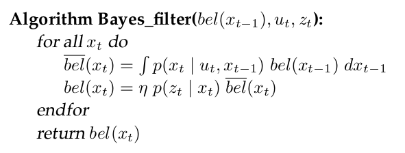

# Filtraggio Bayesiano

I dati dei sensori si portano dietro un'incertezza che andiamo a modellare.
È meglio sovrastimare l'incertezza che sottostimarla:

- se sottostimo potrei non includere il valore che sto cercando
- se la sovrastimo aumento la complessità computazionale

**Ripasso generico di probabilità e statistica**

$P(x=X, y=Y) = P(x, y)$ se $x,y$ sono indipendenti allora $=p(x)*p(y)$.

Se x e y sono dipendenti e conosciamo, ad esempio, $y$ allora abbiamo la probabilità condizionata $P(X|Y) = \frac{P(x,y)}{P(y)}$

Abbiamo il teorema della probabilità totale:

$$
\sum_{y} P(x|y)*P(y) = P(x)
$$

Regola di Bayes:

$$
P(x|y) = \frac{P(y|x)*P(x)}{P(y)}
$$

$P(y|x)$ è chiamato **modello generativo** del dato sensoriale.

Ho un sistema di due equazioni:

- la prima rappresenta lo stato in funzione dello stato precedente e del _controllo_ $u(t)$
- la seconda rappresenta la misura $(z(t))$ come funzione dello stato

$$
\begin{cases}
x(t+1) = f(x(t), u(t)) \\
z(t) = g(x(t))
\end{cases}
$$

**Ipotesi Markoviana**: tutta la storia degli stati/misure è riassunta nella probabilità condizionata rispetto allo stato precedente.

Probabilità di transizione di stato:

$$
P(x_t | x_{0:t-1}, z_{1:t-1}, u_{1:t}) = P(x_t | x_{t-1}, u_t)
$$

Probabilità della misura:

$$
P(z_t | x_{0:t}, z_{1:t-1}, u_{1:t}) = p(z_t | x_t)
$$

La belief (nuova stima della distribuzione) è: 

$$
bel(x_t) = P(x_t | z_{1:t}, u_{1:t})
$$

L'aspettativa (predizione) è:

$$
\overline{bel}(x_t) = P(x_t | z_{1:t-1}, u_{1:t})
$$

## Filtro di Bayes

{ width=75% }

## Kalman

Bayes filter nel caso in cui le variabili sono di tipo normale: **filtri gaussiani**, il filtro di Kalman è uno di questi.

Modello del sistema:

TODO che schifo tex

3 ipotesi per **Kalman**:

- funzione di trasferimento di stato deve essere lineare
- funzione di trasferimento di uscita deve essere lineare
- $bel(x_0)$ deve essere normale

Questo mantiene la "normalità" delle variabili in gioco nel modello.

Se ho $y = f(x)$ con $x$ distribuita normalmente allora se $f$ è lineare allora anche $y$ avrà distribuzione normale, se $f$ non è lineare allora $y$ non sarà normale.

