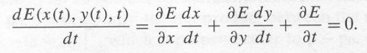
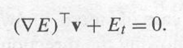
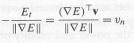

# Analisi di sequenze di immagini

Oltre al campionamento spaziale/intensità abbiamo anche il campionamento temporale.

In generale gli spostamenti di tempo sono piccoli (alta frequenza di campionamento temporale)

Il movimento di un punto in una sequenza di immagini può essere causato:
- dal movimento dell'oggetto nella scena
- dal movimento della camera
- entrambi

Il primo caso e il secondo in generale non sono distinguibili.

Ricerca corrispondenze facilitata dall'ampia frequenza di campionamento temporale.
La "baseline" è piccola, la qualità di ricostruzione è pessima se guardiamo solo due dati immagini consecutivi.

**Structure from motion**

**Time to impact**: da sequenza troviamo il tempo mancante per andare a sbattere contro un certo ostacolo andando a guardare come varia la dimensione dell'ostacolo.

**Analgie con problemi stereo**:

- Problema corrispondenze: trovare quali elementi di un frame corrispondono a quali elementi del frame successivo.
- Ricostruzione: dato un certo numero di elementi corrispondenti (e eventualmente i parametri intrinseci della camera) cosa possiamo dire sul movimento 3d e sulla struttura del mondo osservato=

**Differenze con problemi stereo**:

- Corrispondenze: visto che le immagini sono campionate temporalmente ad istantei vicini le differenze spaziali (disparity) sono, in media, molto più piccole di quelle trovate nei match stereo.
- Ricostruzione: il movimento 3d tra camera e scena non è necessariamente causato da una singola trasfomrazione 3d rigida.

Per il problema delle corrispondenze abbiamo il vantaggio di avere piccoli movimenti (campionando ad alta frequenza). Questo permette due cose:

1. Per gli approcci feature based possiamo usare tecniche di _tracking_ che sfruttano la storia passata delle feature per predirre le disparity nel frame successivo.
2. Date le piccole diffrenze nei frame consecutivi si più anche adottare la tecnica di stimare il movimento apparente del pattern di luminanza dell'immagine, problema noto come **optical flow**.

Per risolvere il problema delle corrispondenze abbiamo 2 approcci:

- **Metodi differenziali**: ci portano ad avere misure dense, calcolate per ogni pixel. Usano stime delle derivate temporale e richiedono alte frequenze di campionamento. Analogo in stereo con metodi gray level
- **Metodi matching**: ci portano ad avere misure sparse, calcolate solo per alcuni punti immagine. Analogo di feature based in stereo.

## Campo di movimento

**Campo di movimento**: vettore delle velocita dei punti.

C'è movimento relativo tra osservatore e oggetti, questo movimento genera un movimento a livello bidimensionale immagine.

Il movimento 3d si proietta nel 2d, campo movimento immagine.

Ho una perdita nella proiezione, non posso pensare di ricostruire campo movimento 3d da campo movimento immagine.

Il campo di movimento immagine che posso trovare è l'**optical flow**.

Per calcolare il motion field andiamo a calcolare le derivate del movimento. Possiamo scomporlo come somma di due componenti, uno dipendente da traslazione e uno dipendente da rotazione.
La parte che dipende dalla rotazione non dà informazioni sulla profondità.

Notiamo che il calcolo del motion field mette in evidenza la necessità di campionamento temporale molto alto: stiamo andando a calcolare delle derivate nel tempo usando dei campioni, se vogliamo che queste derivate approssimino al meglio la derivata "vera" (nel continuo) dobbiamo avere i campioni molto vicini temporalmente.

Come modifica la posizione del punto immagine (statico) quando l'osservatore effettua un movimento puramente traslatorio?
3 situazioni:

- Focus of expansion -> situazione in cui ci stiamo avvicinando al punto.
- Focus of contraction -> situazione in ci stiamo allontanando dal punto.
- Fuoco all'infinito -> situazione cui ci muoviamo in modo parallelo e tutti i vettori del campo di movimento sono paralleli.

Nei primi due casi abbiamo un campo movimento radiale: è fatto da vettori che "radiano" dal punto "vanishing".

TODO motion parallax? epipolo all'infinito?

## Optical flow e quazione costanza luminanza immagine

Stima del motion field da una sequenza immagini.

Supponiamo che la luminanza sia continua e differenziabile quante volte necessarie sia nello spazio che nel tempo.

Abbiamo più definizioni di punto immagine:

- Punto immagine -> punto dell'immagine con certe coordinate (u,v)
- Punto immagine -> punto corrispondente allo stesso punto scena

Nel corso del tempo la luminanza dello stesso punto immagine (seconda definizione) rimane costante.

Funziona solo con superfici perfettamente lambertiane (Una superficie di Lambert o lambertiana è una superficie ideale che riflette l'energia incidente da una direzione in modo uguale in tutte le direzioni, per cui variando il punto di vista la sua luminanza non cambia. È quindi una superficie diffondente ideale).

In termini matematici possiamo dire che:

$$
\frac{dE}{dt} = 0
$$

Con $E$ in funzione di $u, v, t$. Dato che $u, v$ sono anch'essi funzioni di t, la derivata totale precedente puà essere scritta come:

{ width=60% }

Le derivate parziali spaziali sono i componenti del gradeinze spaziale $\nabla E$ e le derivate temporali sono i componenti del vettore di moto.
Possiamo quindi riscrivere l'equazione sopa come **equazione di costanza luminanza imagine**:

{ width=50% }

### Problema dell'apertura

Per rendermi conto del reale spostamento immagine ho bisogno di vedere l'intero oggetto.
Se guardo il mondo attraverso l'apertura non vedo il vero spostamento.
Il problema dell'apertura si verifica in quanto guardiamo il gradiente soltanto localmente ad un punto, non globalmente.

_Il componente del campo di moto in direzione ortogonale al gradiente spaziale non è vincolato dall'equazione di costanza luminanza immagine_

(Nella pratica abbiamo un'equazione e due incognite quindi non riusciamo a trovare una soluzione unica ma una retta nel sistema (u,v). L'unico punto su questa retta che possiamo trovare con certezza è il componente normale)

{ width=40% }

### Metodi differenziali per stima dell'optical flow

Fare derivate esalta il rumore, meglio usare il minor ordine di derivata possibile.

**Metodo LSE**

Prendiamo una patch $N \times N$, assumendo che il movimento all'interdo di questa patch sia lo stesso per tutti i punti, per ogni punto posso fare il calcolo dell'equazione di costanza luminanza immagine.

Faccio un sistema con tutti i punti e vado a trovare il campo di movimento che minimizza il LSE.

### Metodi matching

Metodo feature matching puro: uso due immagini consecutive e faccio match tra le feature, come in stereo.
I punti feature vengono anche chiamati **key points**.
Per descrivere i key points esistono dei descrittori, come SIFT, SURF, ORB...

Abbiamo più frame, quindi possiamo usare metodi di  **feature tracking**.

Non facciamo soltanto match con i descrittori ma prendiamo in considerazione anche il movimento.
Facciamo delle previsioni in base alle posizioni precedenti.

Si usano vari tipi di filtraggio, tra cui Kalman.

Quindi non ci interessa solo la posizione del punto, ma anche la sua velocità. Le camere non misurano velocità ma possiamo avere una stima di velocità facendo derivate su spazio, ma è tutto rumoroso.

I problemi del filtraggio sono 2:

1. **Missing information**: tutti i modelli bayesiani si basano sul fatto che io possa fornire dei valori probabilistici da usare nel modello. Devo avere il modello del sistema con la sua covarianza, il modello di misura con la sua covarianza e la stima iniziale dello stato, con la sua covarianza.
2. **Data association**: problema di fare matching.

