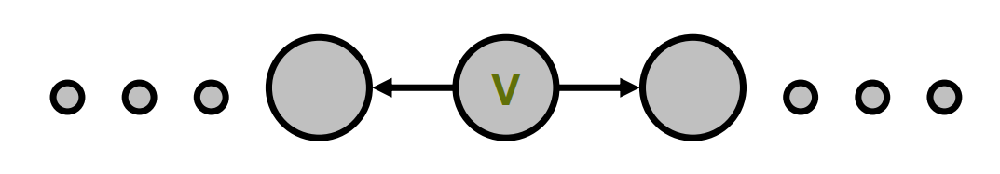
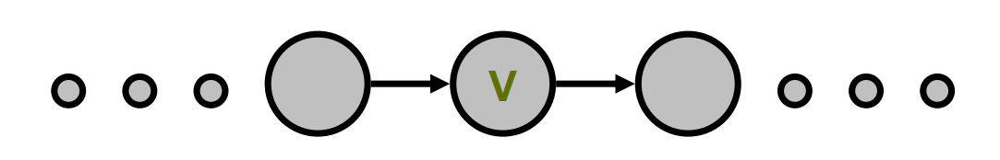
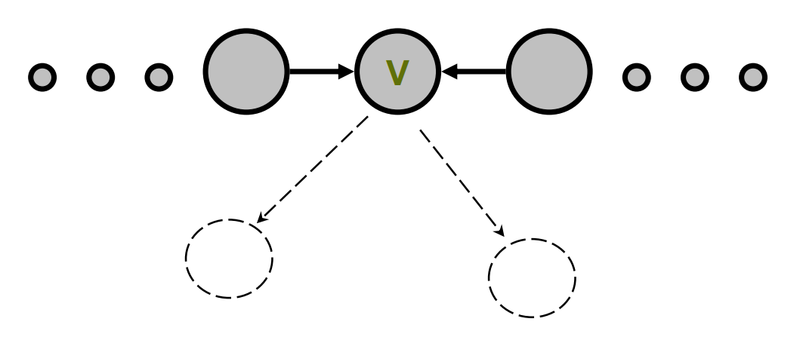
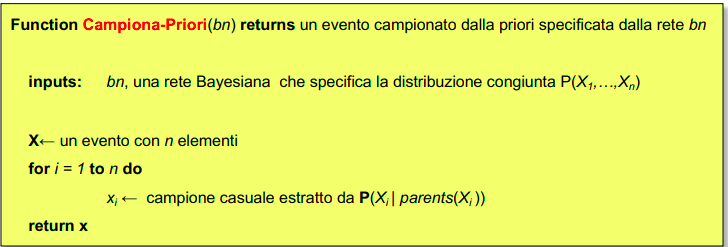

# Modelli Probabilistici per le Decisioni

## Richiami di statistica

$P(A \lor B) = P(A) + P(B) - P(A\land B)$

$P(A \land B) = P(A|B)*P(B) = P(B|A)*P(A)$

$P(A|B) = (P(B|A)*P(A))/P(B)$

## Reti bayesiane

Una rete bayesiana è un DAG in cui i nodi rappresentano gli eventi e gli archi i rapporti di causalità tra essi.

Ogni Rete Bayesiana costituisce una descrizione completa del dominio che rappresenta e pertanto ogni elemento della distribuzione di probabilità congiunta può essere calcolato a partire dall'informazione contenuta nella rete.

**Formula di fattorizzazione della distribuzione congiunta di probabilità**:

$$
P(x_1,\dots,x_n) = \prod^n_{i = 1} P(x_i | parents(X_i))
$$

**Chain rule**:

$$
P(x1,\dots,x_n) = \prod^n_{i = 1} P(x_i | x_{n-1}, \dots, x_1)
$$

Formula di fattorizzazione e chain rule sono equivalenti a patto che $Parents(x_i) \subseteq {x_{i-1}, \dots, x_1}$

**Markov Blanket**: dato un nodo la sua markov blanket è data dai suoi genitori, dai suoi figli e dai genitori dei suoi figli.

Un nodo è condizionalmente indipendente dai nodi restanti data la conoscenza della sua markov blanket.

**D-separazione**: X e Z sono d-separate da un insieme E di variabili con evidenza sse   ogni cammino non orientato da X e Z è bloccato.

Un cammino è bloccato sse vale una delle 3 condizioni:

1. Lungo il cammino esiste una variabile V tale che appartiene all'insieme E delle variabili con evidenza e gli archi che collegano V al cammino sono "tail to tail"
   
   

2. Esiste una variabile V lungo il cammino tale che appartiene all'insieme E delle variabili con evidenza e gli archi che collegano V al cammino sono "tail to head"
   
   

3. Esiste una variabile V sul cammino tale che NON appartiene all'insieme E delle variabili con evidenza, nessuno dei suoi discendenti appartiene all'insieme E delle variabili con evidenza e gli archi che collegano V al cammino sono "head to head"
   
   

## Generazione di numeri casuali

**MCM (moltiplicative congruential method)**

$$
x_n = ax_{n-1} \\

0 \leq x_n \leq m
$$

$x_0$ valore iniziale (seed)

$a, m$ interi positivi opportunamente scelti

**LCM (linear congruential method)**:

$$
x_n = (ax_{n-1} + c) \bmod m
$$

$x_0$ valore iniziale

$a, c, m$ opportunamente scelti

$a, c \geq 0;  m> x_0, c , a$

**D-RNG**: Per generare variabili discrete uso la distribuzione cumulativa. Ordino le probabilità in ordine decrescente, estraggo numero casuale e confronto.

**Metodo acceptance-rejection:**

Genero campioni casuali e controllo se il campione è contenuto all'interno del plot della funzione della probabilità di densità.

## Reti bayesiane (inferenza approssimata)

**Algoritmo campiona priori** (per inferenza su reti senza variabili con evidenza)

**Campionamento con rigetto (rejection sampling)** (per inferenza su reti con variabili con evidenza): è l'algoritmo campiona priori, quando estraiamo un sample non consistente con l'evidenza scartiamo quel sample. Ovviamente ciò implica molti calcoli inutili all'aumentare delle variabili con evidenza.

**Likelihood weighting**: fissa i valori delle variabili con evidenza e genera campioni solo per i nodi restanti. Inoltre pesa in modo differente i vari eventi, il peso di ogni evento è il likelihood che l'evento associa all'evidenza.

- il meccanismo di likelihood weighting utilizza tutti i campioni generati 

- all’aumentare del numero di nodi con evidenza la performance degrada in quanto molti dei campioni estratti avranno un peso infinitesimale; la stima sarà interamente dipendente da pochissimi campioni con peso comunque piccolo.

$$
P(A = true | E) = \frac{\sum_{s_i:A=true} W_{si}}{\sum_{s_i} W_{si}}
$$

Algoritmo:

- estraggo un campione casuale per le variabili di cui non ho evidenza

- calcolo la probabilità delle variabili con evidenza dati i genitori  e moltiplico: questo è il peso associato al sample.

**Markov Chain Monte Carlo**

Algoritmo:

- Genero casualmente il primo set (escluse le variabili con evidenza)

- Ad ogni step calcolo la probabilità di una variabile senza evidenza a partire dal set di variabili calcolato allo step precedente, usando la sua markov blanket

$$
P(x | MB(X)) = \alpha \cdot P(x | Parents(X)) \cdot \prod_{y \in Children(x)} P(y|Parents(y))
$$

- estraggo un numero casuale e vedo il valore che assume la variabile

- loop a partire da step 2 per n volte

## Catene di Markov

**Proprietà markoviana**: la distribuzione di probabilità per tutti i possibili valori futuri del processo dipende solo dal loro valore corrente e non dai valori passati o da altre informazioni correnti.

$$
P(X_{t+1} | X_t = i_t, X_{t-1} = i_{t-1}, \dots, X_1 = i_1, X_0 = i_0) = P(X_{t+1} = i_{t+1} | X_t = i_t)
$$

I processi stocastici che soddisfano questa proprietà sono detti **Processi di Markov**

Se la probabilità di un certo evento è indipendente dal tempo t la catena di Markov si definisce **stazionaria** e si ha che 

$$
P(X_{t+1} = j | X_t = i) = p_{ij}
$$

$p_{ij}$: probabilità che al tempo t+1 il sistema sarà nello stato j, essendo nello stato i al tempo t.

Uno stato $j$ è **raggiungibile** da uno stato $i$ se esiste un cammino che da $i$ arriva a $j$:

$$
P^n_{ij} > 0 
$$

Due stati $i$ e $j$ si dice che **comunicano** se $j$ è raggiungibile da $i$ e viceversa.

Ogni stato comunica con se stesso per definizione e vale la proprietà transitiva.

Una catena di Markov è detta **irriducibile** se tutti i suoi stati sono comunicanti tra di loro.

Un insieme di stati $S$ di una catena di Markov è un **insieme chiuso** se nessuno stato fuori $S$ è raggiungibile dagli altri stati in $S$

Uno stato $i$ si definisce **stato assorbente** se $p_{ii} = 1$.

Uno stato $i$ si definisce **stato transiente** se esiste uno stato $j$ raggiungibile da $i$ ma $i$ non è raggiungibile da $j$

Uno stato che non è transiente viene definito **stato ricorrente**.

La ricorrenza è una proprietà di classe: se lo stato $i$ è ricorrente e lo stato *j* comunica con $i$ allora lo stato $j$ è ricorrente.

Anche essere transiente è una proprietà di classe.

Tutto gli stati di una catena di Markov **finita** (n. stati finito) irriducibile sono ricorrenti.

Una catena di Markov è **regolare** se esiste un $n$ tale che la matrice $P^n$ ha tutte le entry strettamente positive.

Uno stato *i* è **periodico** di periodo $k>1$ se $k$ +è il più piccolo numero tale che tutti i cammini che dallo stato $i$ tornano ad $i$ hanno una lunghezza che è un multiplo di $k$

Se uno stato non è periodico si definisce **aperiodico**

Una catena è periodica se almeno uno stato è periodico.

Se tutti gli stati di una catena sono ricorrenti, aperiodici e comunicano l'uno con l'altro la catena si definisce **ergodica**

**Distribuzione di equlibrio (steady state)**: Sia $P$ una matrice delle probabilità per una *catena ergodica* di N stati vale che:

$$
lim_{t\rightarrow +\inf} P_{ij}(t) = \pi_j
$$

$\pi = [\pi_1 \pi_2 \dots \pi_n]$

$\pi = \pi \cdot P$

Questa proprietà è anche detta **teorema della convergenza**.

Esiste anche il **teorema di esistenza e unicità**: se la catena di Markov è irriducibile e ricorrente positiva allora esiste un'unica distribuzione stazionaria.

Il comportamento di una catena di Markov prima di raggiungere la distribuzione di equlibrio è chiamato **transitorio**.

**Passaggio intermedio**: numero di transizioni attese prima di raggiungere lo stato $j$ essendo nello stato $i$ in una catena ergodica:

$$
m_{ij} = 1 + \sum_{k\neq j} p_{ik} \cdot m_{kj} \\
m_{ii} = 1/\pi_i
$$

**Matrice di transizione per catene assorbenti:**

$$
\left(
    \begin{array}{c|c}
      Q & R\\
      \hline
      0 & I
    \end{array}
    \right)

$$

$Q$ matrice che rappresenta le relazioni tra gli stati transienti

$R$ matrice che rappresenta le transizioni da stati transienti a assorbenti

Se siamo in uno stato transiente $i$, il numero di periodi che si trascorreranno in uno stato transiente $j$ prima dell'assorbimento nello stato è l'elemento $ij$-esimo elemento della matrice $(I-Q)^{-1}$

Se siamo in uno stato transiente $i$, la probabilità di arrivare in uno stato assorbente $j$ è l'elemento $ij$-esimo della matrice $(I-Q)^{-1} \cdot R$

## Hidden Markov Model

Modellare un mondo che evolve:

- Un set $X_t$ di variabili di stato non osservabili al tempo $t$

- Un set $E_t$ di variabili osservabili al tempo $t$

- La dipendenza tra di esse

- L'ipotesi che i cambiamenti del mondo siano regolati da un processo stazionario

- Ipotesi di Markov del primo ordine

Catena di Markov a stati nascosti è un processo stocastico caratterizzato da:

- un insieme di stati $X_t$

- un insieme di osservazioni $E_t$

- Una matrice delle probabilità di transizione $P(X|X_{0:t-1}) = P(X|X_{t-1})$

- Una matrice delle probabilità di emissione delle osservazioni $P(E_t | X_{0:t-1}, E_{0:t-1}) = P(E_t|X_t)$

- Matrice delle probabilità iniziali degli stati al tempo 0 $P(X_0)$

Modello sensoriale:

$$
P(E_t|X{0:t-1}, E_{0:t-1}) = P(E_t | X_t)
$$

Per ogni t finito la distribuzione congiunta risulta:

$$
P(X_0, X_1, \dots, X_t, E_1, \dots, E_t) = P(X_0)\prod^t_{i=1}P(X_i | X_{i-1})P(E_i|X_i)
$$

**<u>Task di inferenza nei modelli temporali:</u>**

- **Filtraggio**: qual è la probabilità dell'evento al tempo t date le osservazioni da 0 a t?

- **Previsione**: qual è la probabilità dell'evento al tempo t+n date le osservazioni da 0 a t?

- **Smoothing**: qual è la probabilità dell'evento al tempo t-1 date le osservazioni da 0 a t?

- **Spiegazione più probabile**: date le osservazioni, qual è la sequenza di stati più probabile?

**<u>Apprendimento:</u>**

- Apprendo il modello di transizione e del modello sensoriale a partire dalle osservazioni.

- L'apprendimento si ottiene come sottoprodotto dell'inferenza: questa fornisce una stima che può essere utilizzata per aggiornare il modello (algoritmo Expectation-Maximization)

- L'apprendimento richiede di effettuare uno smoothing completo.

#### Filtraggio

Calcolo a posteriori dello stato corrente date tutte le osservazioni

$$
P(X_t|e_{1:t})
$$

Stima ricorsiva! Date le distribuzioni fino al tempo $t-1$ si può calcolare la distribuzione al tempo $t$ della nuova prova $e_t$

$$
P(X_t|e_{1:t}) = f(e_t, P(X_{t-1}|e_{1:t-1}))
$$

Dato il risultato del filtraggio al tempo $t$ si proietta in avanti la distribuzione dello stato corrente da $t$ a $t+1$

Si aggiorna in base alla nuova prova $e_{t+1}$

$$
P(X_{t+1}|e_{1:t+1}) = P(X_{t+1}|e_{1:t}, e_{t+1})) = \\
\alpha P(e_{t+1}|X_{t+1}, e_{1:t})P(X_{t+1}, e_{1:t}) = \\
\alpha P(e_{t+1}|X_{t+1})P(X_{t+1}, e_{1:t})
$$

Quindi prima calcolo $P(X_{t+1} | e_{t}) = \sum_{x_t} P(X_{t+1}|x_t)P(x_t)$

Poi aggiorno con l'osservazione $P(X_{t+1} | e_{t+1},e_t) = \alpha P(e_{t+1}|X_{t+1})P(X_{t+1} | e_{t})$

#### Calcolo verosimiglianza:

Possiamo usare una ricorsione per il calcolo della verosimiglianza di una sequenza di prove $P(e_{1:t})$

Verosimiglianza di sequenze molto lunghe rischia underflow (numeri troppo piccoli)

**Probabilità di una sequenza di stati:**

Data sequenza $S$, 

$$
P(S) = \prod_{t=1}^{T-1} T_{t,t+1}
$$

Quindi parto da vettore delle prob iniziali, prendo la probabilità dell'elemento $s_o$  poi moltiplico $P(s_0)$ per $P(s_1|s_0)$ e così via per tutti gli stati.

**Likelihood sequenza di osservazioni data sequenza di stati:**

Data sequenza di osservazioni $E$ e sequenza di stati $S$

$$
P(E|S) = \prod^T_{i=1}P(e_i|s_i)
$$

**Likelihood della sequenza di stati e osservazioni:**

Calcolo le due likelihood separatamente come sopra e le moltiplico

#### Previsione

$$
P(X_1 = x) = \sum_{x_0} P(X_1 = x | x_0)P(x_0)
$$

Algoritmo mini-forward.

La predizione è un filtraggio privo dell'aggiunta di nuove osservazioni.

Faccio filtraggio fino al momento in cui ho osservazioni, poi moltiplico il risultato per la matrice di transizione elevata ad $m$.

Ad esempio se ho $k$ osservazioni e voglio predire lo stato al tempo $n$, filtro con le $k$ osservazioni e moltiplico il risultato per la matrice di transizione elevata a $n-k$

#### Smoothing

$$
P(X_k | e_{1:t}) \\

per 1 \leq k < t
$$

Consideriamo separatamente le osservazioni fino a $k$ e quelle da $k+1$ a $t$

$$
P(X_k | e_{1:t}) = P(X_k | e_{1:k}, e_{k+1:t}) = \\
\alpha P(X_k|e_{1:k})P(e_{k+1:t}|X_k, e_{1:k}) = \\
\alpha P(X_k|e_{1:k})P(e_{k+1:t}|X_k) = \\
\alpha f_{1:k}b_{k+1:t} 
$$

Algoritmo forward-backward.

Procedura ricorsiva di backward che procede all'indietro da $t$

3 passi:

- Passo forward -> uguale a filtraggio.

Calcolo da $f_0$ a $f_t$

$f_0 = \pi$

$f_1 = \alpha \cdot f_0 \cdot T \cdot E_{1}$

...

- Passo backward -> $P(e_{k+1:t}|x_k)$:

Calcolo da $b_t$ a $b_0$

$b_t = <1, 1>$

$b_{t-1} = \alpha \cdot T \cdot E_{t-1} \cdot b_t$

...

- Passo di smooting -> prodotto delle due probabilità

$\delta_1 = \alpha \cdot f_1 \cdot b_2$

$\delta_2 = \alpha \cdot f_2 \cdot b_3$

...

#### Sequenza più probabile

Algoritmo di Viterbi.

Trellis

Grafo con $n$ (numero di stati) rami, che a loro volta hanno $m$ (numero di osservazioni) figli, uno in fila all'altra.

Calcolo le probabilità degli stati (ovvero di ogni nodo) come probabilitàPrecedente * probabilitàTransizione * probabilitàOsservazione.

Per il primo step calcolo probabilitàIniziale * probabilitàOsservazione.

Una volta calcolati tutti scelgo il percorso migliore partendo dal fondo, andando via via a vedere qual è lo stato che più probabilmente mi ha portata lì.

### Altri filtraggi (Kalman & co.)

##### Filtro di Kalman:

Stimare lo stato di un sistema dinamico partendo da una sequenza di osservazioni rumorose.

**Modello di transizione**: descrive la fisica del moto

**Modello sensoriale**: descrive il processo di misurazione

Il sistema è descritto da un insieme di variabili continue.

Ho modello di transizione con aggiunta di rumore gaussiano, ottenendno un modello di transizione gaussiano lineare.

Anche modello sensoriale è gaussiano lineare.

Dopo aver aggiornato modello con predizione a un passo e aggiornamento rispetto alla nuova evidenza abbiamo sempre una distribuzione gaussiana lineare.

Sono richieste 3 distribuzioni di probabilità:

- belief iniziale $P(X_0)$, Kalman filter assume distribuzione dello stato iniziale gaussiana

- probabilità della misura $P(Z_t|X_t)$, Kalman filter assume la distribuzione di misura gaussiana lineare

- probabilità di transizione $P(X_t | X_{t-1})$, Kalman filter assume il sistema dinamico lineare

###### Extended Kalman Filter:

Le trasformazioni tra stati e misure raramente sono funzioni lineari.

Probabilità di transizione tra stati e probabilità di misura regolate da funzioni non lineari $g$ e $h$

$$
x_t = g(u_t, x_{t-1}) + \varepsilon_t \\
z_t = h(x_t) + \delta_t
$$

EKF calcola un'approssimazione di $g$ e $h$ con un'espansione di Taylor del primo ordine nel punto che è media della gaussiana approssimata allo step precedente.

##### Filtri NON parametrici

No assunzioni parametriche rigide sulla densità di probabilità a posteriori.

Vanno molto bene per rappresentare belief multimodali.

###### Histogram filter:

Decompone lo spazio degli stati in un numero finito di regioni. Un istrogramma assegna a ciascuna regione una singola probabilità cumulata.

###### Particle filter:

Rappresentare la probabilità a posteriori $bel(x_t)$ attraverso un insieme di campionamenti random dello stato disegnati da questa probabilità.

Particles: campioni di probabilità a posteriori $x_t^{[m]}$

$$
x_t = x_t^{[1]}, x_t^{[2]}, \dots,x_t^{[M]}
$$

Un particle è un'ipotesi su come potrebbe essere lo stato al tempo $t$

Idealmente la likelihood dell'ipotesi di stato $x_t$, perchè sia inclusa tra i particles deve essere proporzionale alla probabilità a posteriori del suo filtro di Bayes:

$$
x_t^{[m]} \sim P(x_t | z_{1:t}, u_{1:t})
$$

Più una regione nello spazio degli stati è densa di campioni tanto è più probabile che il vero stato sia in quella regione.
