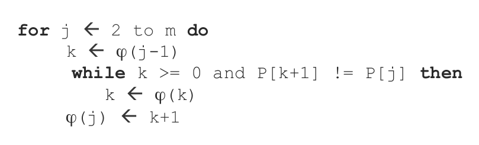

# Pattern Matching

## Pattern matching esatto
Input: un testo $T$ di lunghezza $n$ e un pattern $P$ di lunghezza $m$, definiti su un alfabeto $\Sigma$

Output: tutte le posizioni $i$ di $T$ in cui inizia una sottostringa $T[i, i + |P| - 1]$ esattamente uguale a $P$

**Bordo di una stringa**: più lungo prefisso proprio di X che occorre come suffisso di X.

### Pattern matching con automi

Algoritmo: 

* Preprocessing del pattern (costruzione tabella transizioni) in tempo $O(m|\Sigma|)$.
* Scansione sul testo di tutte le occorrenze del pattern in tempo $O(n)$.

Prima si costruisce tabella transizioni dell'automa per il pattern con la funzione:
$$
\delta(j, \sigma) : \{0 \dots m \} \times \Sigma \rightarrow \{0 \dots m \}
$$

$$
\delta(j, \sigma) = j + 1 \iff j < m \land P[j+1] = \sigma
$$

$$
\delta(j, \sigma) = k \iff P[j+1] \neq \sigma \lor j = m 
$$
$$
k = |B(P[i,j] \sigma)|
$$

Per scansione testo utilizzo la tabella. Se sto scansionando, arrivo a T[q] e questo mi porta nello stato finale (stato $m$), allora c'è un occorrenza del pattern alla posizione $q-m+1$.

### KMP

* Preprocessing del pattern (costruzione di $\varphi$) in tempo $O(m)$
* Scansione del testo in tempo $O(n)$

**Funzione di fallimento $\varphi$**:
$$
\varphi : \{0 \dots m\} \rightarrow \{-1, 0, 1, \dots, m-1 \}
$$

* $\varphi(j) = |B(P[1,j]|$ per $1 \le j \le m$
* $\varphi(j) = -1$ per $j = 0$

**Definizione per induzione**
$$
\varphi(0) = -1
$$
$$
\varphi(1) = 0
$$
$$
\varphi(j) = |B(P[1, j-1])P(j)|
$$
Algoritmo ricorsivo per $\varphi$:

**Scansione del testo**: si procede confrontando una finestra $W$ lunga $m$.

* $i$ indice della scansione su $T$
* $j$ indice della scanzione su $P$
* $p$ indice della posizione della finestra su $T$

Parto mettendo la finestra all'inizio di $T$ e inizio a confrontare i caratteri di $T$ e $P$.
Quando trovo un mismatch l'indice della posizione della finestra diventa 

$p = i + j - \varphi(j-1) - 1$.

Ricomincio la scansione su T partendo dall'indice:

$i = i + j - 1$

Ricomincio la scansione su P partendo dal simbolo in posizione:

$j = \varphi(j-1) + 1$

 
### Bayeza-Yates e Gonnet

* Preprocessing patter in tempo $O(|\Sigma|m)$
* Scansione del testo in tempo $O(n)$

Per ogni simbolo $\sigma$ dell'alfabeto $\Sigma$ ho associata la sua $B_{\sigma}$ di lunghezza $m$

$B_{\sigma} = b_1, \dots, b_m$

$B_{\sigma}[i] = b_i = 1 \iff P[i] = \sigma$

Per fare match su stringa ho le $D_j$

$D_j = d_1, \dots, d_m$ 
$d_i = D_j[i] = 1 \iff P[1,j] = suff(T[1,j])$

$D_j = \text{RSHIFT1} (D_{j-1}) \text{ AND } B_{\sigma = T[j]}$

Ogni volta che $D_j$ ha il bit meno significativo uguale a $1$ ho un match alla posizione $j - m + 1$

$|B(P)| = i \iff D_j[m] = 1$ e $i$ è la più grande posizione $<m$ tale che $D_j[i] = 1$

## Pattern matching approssimato
Dato un pattern $P$ e un testo $T$, definiti su alfabeto $\Sigma$ e un soglia di errore $k$ diciamo che:

$P$ ha un'occorrenza approssimata in $T$ in posizione $j$ se esiste una sottostringa $T[j- L + 1, j]$, che ha distanza di edit con $P$  al più pari a $k$ (occorrenza con al più $k$ errori).

### Wu-Manber
* Preprocessing del pattern in tempo $O(|\Sigma|m)$ (come Bayeza-Yates)
* Scansione del testo in tempo $O(nk)$

Preprocessing del pattern: lo stesso di Bayeza-Yates.

Scansione del testo:

Ho le parole $D^h_j$ dove $h$ è il numero di errori rispetto al pattern.

$D_j^h[m] = 1 \iff P[1,j] = suff_h(T[1,j])$

Dove con $suff_h$ intendiamo suffisso con al più $h$ errori.

$$
\begin{array}{c}
D_j^h = \text{RSHIFT1}(D^h_{j-1}) \text{AND} B_{T[j]} \\
\text{OR} \\
\text{RSHIFT1}(D^{h-1}_{j-1}) \\
OR \\
\text{RSHIFT1}(D_j^{h-1}) \\
OR \\
D^{h-1}_{j-1}
\end{array}
$$

$D^h_j = 1 \rightarrow D_j^{h'} = 1$ per $h' > h$

I primi $h$ bit di $D_j^h$ sono sempre 1

Per costruire le varie $D$ prima itero su $j$, poi su $k$.

## Text indexing

**Struttura di indicizzazione**: struttura dati che riorganizza un testo in maniera da rendere facile ed efficiente un compito che eseguito sul testo originale risulta essere difficile e inefficiente.

### Suffix array

* Occupa $O(n \log n)$ spazio
* Non contiene informazioni sui simboli del testo
* Permette la ricerca esatta di un pattern in un testo in tempo $O(m \log n)$

### BWT

### Ricerca esatta con FM-index

